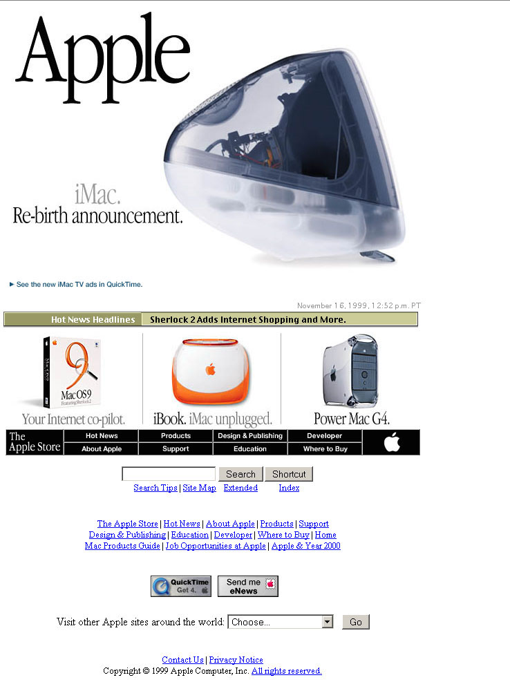
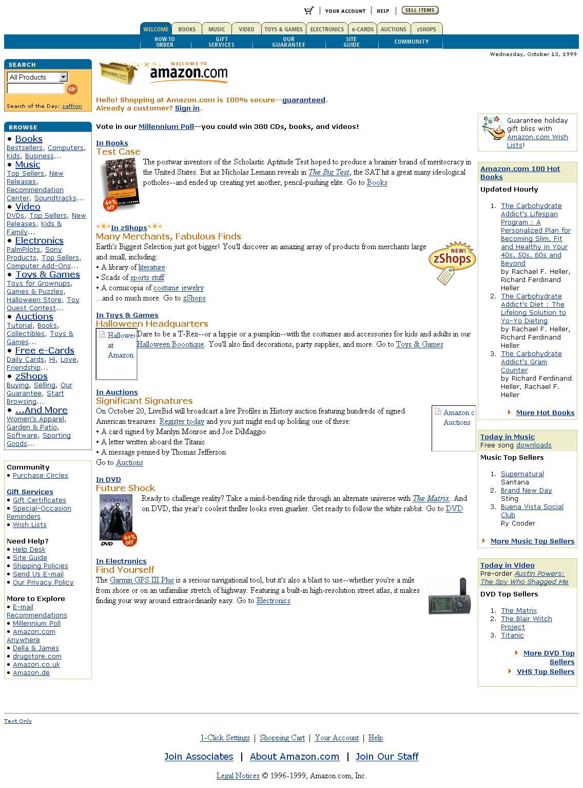
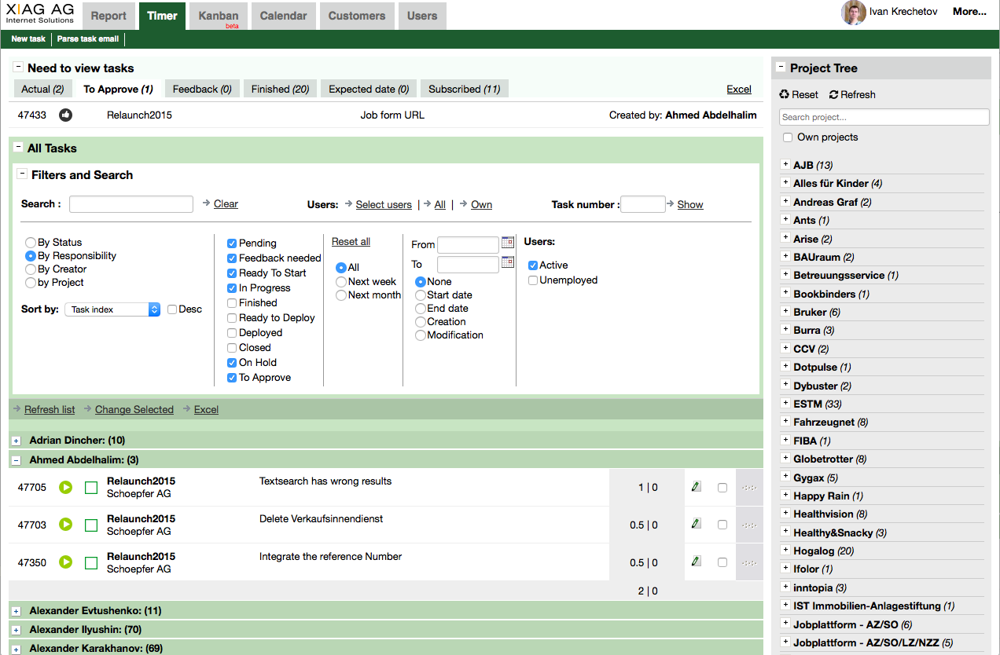
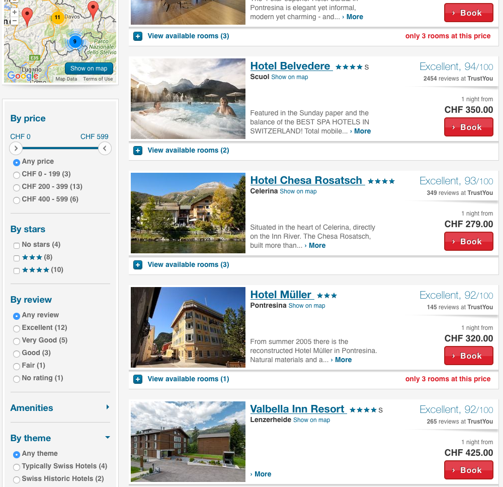
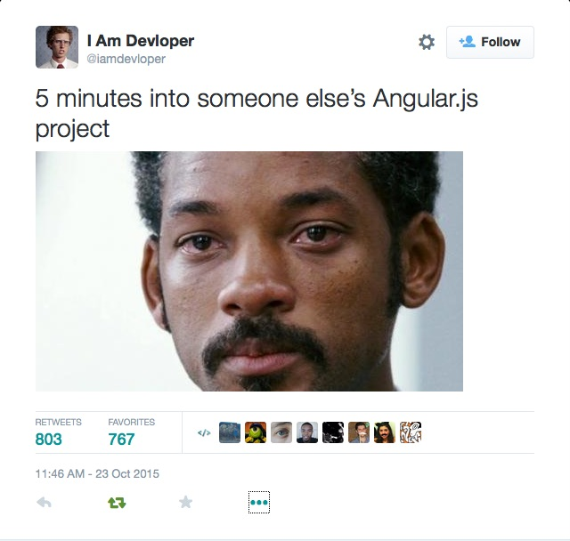
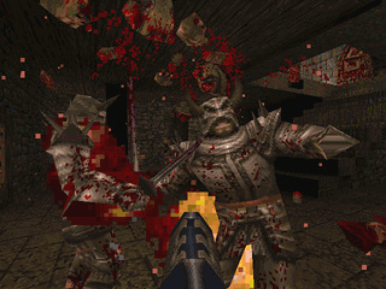

## Intro to React and
## the Elm Architecture

---

## I love the 90's

---

 

---

## GUI = λ(DB, request)

---

# Math, baby

F˚= C˚•9/5 + 32

I = V/R

r(Θ) = 1 - sin(Θ)

y = x²

---

## Referential transparency

---

## Simple

---

## Then AJAX happened

---

 

---

* jQuery/UI
* Dojo
* YUI
* Backbone
* Kendo UI
* Knockout
* Ember
* AngularJS
* ...

---

While I was speaking, at least 2 new JavaScript frameworks have been released

---

**React** is a quantum leap

---

# React

A JavaScript *library* featuring a virtual DOM for rendering HTML

# Elm

Functional programming language for the browser without runtime exceptions

---

## Quick demo

---

# In essence

---

# The awesome

1. GUI as a pure function
  * Utter simplicity
1. Interactivity is still there
  * handling is postponed to next frame
  
---

* Unidirectional data flow
* Single source of truth (a-la DB)
* No cascading updates
* No combinatorial explosion of state transitions
* Trivial undo/redo support
* Seamless rendering on both client & server

---

That's the future

So much bigger than JavaScript
